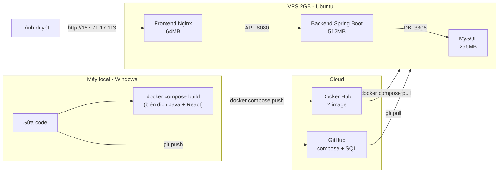

# Hướng dẫn deploy VietSkin

Quy trình: **build ở máy LOCAL → đẩy image lên Docker Hub → VPS chỉ kéo image về chạy** (VPS yếu không build).

| Hạng mục | Giá trị |
|----------|---------|
| VPS | Ubuntu, IP `167.71.17.113` |
| Docker Hub user | `triduc12` |
| Image backend | `triduc12/vietskin-backend` |
| Image frontend | `triduc12/vietskin-frontend` |
| Repo | `https://github.com/letriduc121121/VietSkinClinic.git` |

---

## Sơ đồ quy trình



---

## Tối ưu RAM cho VPS yếu (1-2GB)

Cấu hình trong [docker-compose.yml](docker-compose.yml) giữ tổng RAM ở mức **~500-600MB**:

| Container | Giới hạn | Cách tối ưu |
|-----------|----------|-------------|
| MySQL | 256MB | Tắt `performance-schema`, buffer pool 64M |
| Backend | 512MB | JVM heap tối đa 256MB (`-Xmx256m`) + G1GC |
| Frontend | 64MB | Nginx chỉ phục vụ file tĩnh |
| Redis | 0MB | Dùng Upstash (cloud), không chạy container |

---

## PHẦN 1 — Trên máy LOCAL (Windows)

> Mở **Docker Desktop** trước khi chạy.

```bash
# 1. Đăng nhập Docker Hub (user: triduc12)
docker login

# 2. Build 2 image (vài phút)
docker compose build

# 3. Đẩy image lên Docker Hub
docker compose push

# 4. Đẩy code (compose + SQL) lên GitHub
git add .
git commit -m "Docker deploy"
git push
```

> URL backend cho frontend được bake sẵn lúc build từ [frontend/.env.production](frontend/.env.production). Đổi IP ở file này nếu VPS khác.

---

## PHẦN 2 — Trên VPS (qua SSH)

```bash
# 1. Vào VPS
ssh root@167.71.17.113

# 2. Lấy code (lần đầu)
cd /root
git clone https://github.com/letriduc121121/VietSkinClinic.git
cd VietSkinClinic

# 3. Tạo file bí mật .env
cp .env.example .env
nano .env          # điền DB_PASSWORD, JWT, Redis, Cloudinary, AI key
                   # lưu: Ctrl+O Enter | thoát: Ctrl+X

# 4. Kéo image về & chạy (KHÔNG build)
docker login
docker compose pull
docker compose up -d --no-build

# 5. Kiểm tra
docker compose ps
docker compose logs -f backend     # Ctrl+C để thoát
```

Mở trình duyệt: **http://167.71.17.113**

---

## Cập nhật về sau (khi sửa code)

**Local:**
```bash
docker compose build && docker compose push
git add . && git commit -m "update" && git push
```

**VPS:**
```bash
cd /root/VietSkinClinic && git pull
docker compose pull && docker compose up -d --no-build
```

---

## Lệnh quản lý (trên VPS)

```bash
docker compose ps                 # trạng thái container
docker compose logs -f backend    # xem log
docker compose restart backend    # khởi động lại 1 service
docker compose down               # tắt (GIỮ dữ liệu DB)
docker compose up -d --no-build   # bật lại

# Nạp lại DB từ đầu (XÓA sạch dữ liệu cũ)
docker compose down -v            # -v xóa volume DB
docker compose up -d --no-build   # tự nạp lại schema + seed

# Mở tường lửa nếu không vào được web
ufw allow 22 && ufw allow 80 && ufw allow 8080 && ufw --force enable
```

---

## Tài khoản test

Đăng nhập bằng **SĐT**, mật khẩu: `Vietskin@123`

| Role | SĐT |
|------|-----|
| admin | 0901234567 |
| lễ tân | 0901234568 |
| bác sĩ | 0901234569 |
| bệnh nhân | 0901234571 |
